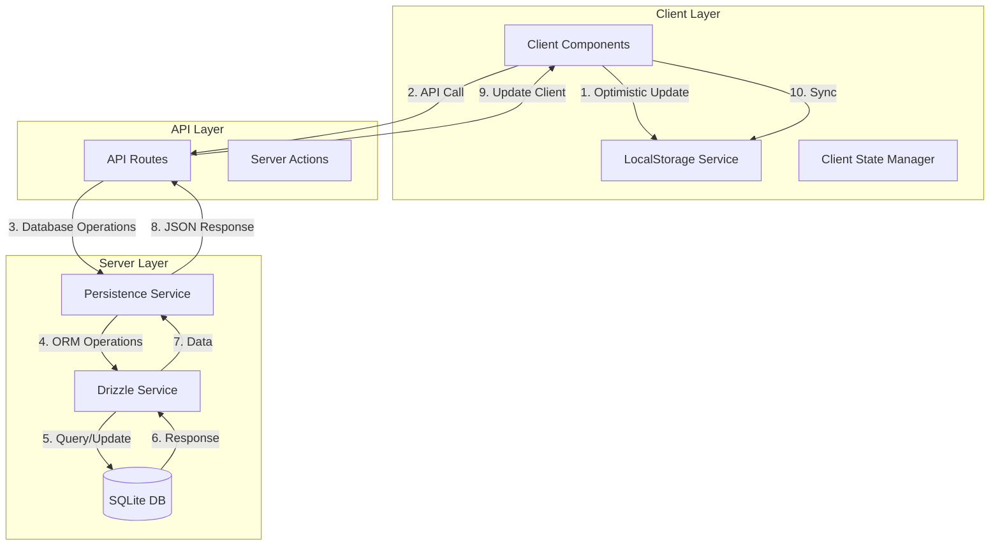

# Chat-Bot Refactoring Plan

## Current Issues

1. **Direct Database Access in Client Code**

   - The hybridPersistenceService is imported and used directly in client components
   - This causes Drizzle ORM (which requires Node.js 'fs' module) to be bundled with client code
   - The architecture doesn't properly separate client and server concerns

2. **Inefficient Data Flow**
   - Client code manages both local storage and database operations
   - No clear separation between optimistic updates and server persistence
   - API routes are not being utilized effectively

## Proposed Architecture



## Implementation Plan

### 1. Create New API Routes

```typescript
// app/api/conversations/route.ts
export async function GET() {
  const conversations = await drizzleService.getAllConversations();
  return NextResponse.json(conversations);
}

// app/api/conversations/[id]/route.ts
export async function GET(
  req: Request,
  { params }: { params: { id: string } }
) {
  const conversation = await drizzleService.getConversation(params.id);
  return NextResponse.json(conversation);
}

export async function POST(
  req: Request,
  { params }: { params: { id: string } }
) {
  const { state, message } = await req.json();
  const result = await drizzleService.updateConversation(
    params.id,
    state,
    message
  );
  return NextResponse.json(result);
}
```

### 2. Refactor Client-Side Storage Service

```typescript
// lib/services/client-storage-service.ts
export class ClientStorageService {
  async saveLocally(id: string, state: InterviewState, message?: Message) {
    // Handle local storage operations only
  }

  async getLocal(id: string) {
    // Get from local storage
  }

  async syncWithServer(id: string) {
    // Sync local state with server
  }
}
```

### 3. Create Server-Side Persistence Service

```typescript
// lib/services/server-persistence-service.ts
export class ServerPersistenceService {
  constructor(private drizzleService: DrizzleService) {}

  async getConversation(id: string) {
    return this.drizzleService.getConversation(id);
  }

  async updateConversation(
    id: string,
    state: InterviewState,
    message?: Message
  ) {
    return this.drizzleService.updateConversation(id, state, message);
  }
}
```

### 4. Update Client Components

```typescript
// app/chat/[id]/page.tsx
"use client";

import { clientStorageService } from "@/lib/services/client-storage-service";

export default function ChatPage() {
  // Replace direct hybridPersistenceService calls with API calls
  const saveMessage = async (message: Message) => {
    // 1. Save locally first (optimistic update)
    await clientStorageService.saveLocally(
      conversationId,
      currentState,
      message
    );

    // 2. Send to server
    const response = await fetch(`/api/conversations/${conversationId}`, {
      method: "POST",
      body: JSON.stringify({ state: currentState, message }),
    });

    // 3. Handle response
    if (response.ok) {
      const result = await response.json();
      // Update local state if needed
    }
  };
}
```

## Migration Steps

### Phase 1: Server-Side Changes

- Create new API routes for all conversation operations
- Move drizzleService to server-only code
- Implement ServerPersistenceService

### Phase 2: Client-Side Changes

- Create ClientStorageService for local storage operations
- Update client components to use API routes instead of direct database access
- Implement optimistic updates with local storage

### Phase 3: Clean Up

- Remove hybridPersistenceService
- Update all imports to use new services
- Add error handling and loading states

### Phase 4: Testing

- Test offline functionality
- Verify data synchronization
- Ensure no client-side database operations

## Benefits

1. **Clean Separation of Concerns**

   - Client code only handles UI and local state
   - Server code manages all database operations
   - Clear API contract between client and server

2. **Improved Error Handling**

   - Better offline support through local storage
   - Clearer error boundaries between client and server
   - Easier to implement retry mechanisms

3. **Better Performance**

   - Optimistic updates for better UX
   - Reduced bundle size by removing Drizzle from client
   - More efficient data synchronization

4. **Enhanced Maintainability**
   - Clear architectural boundaries
   - Easier to test each layer independently
   - Simpler to add new features or modify existing ones

# Note to Len

- Next step bug fixes -- loading UI on conversation load
- Make sure table looks good
