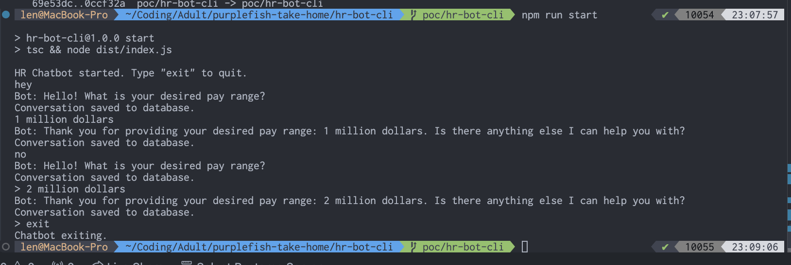
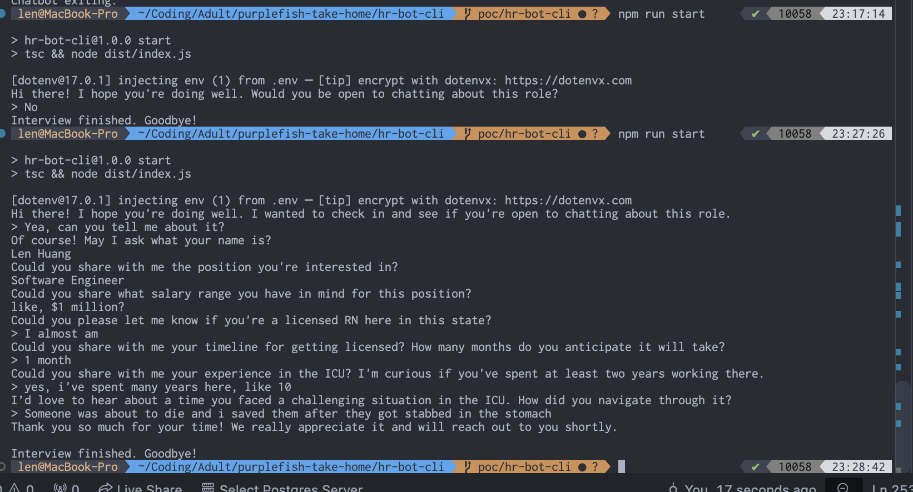
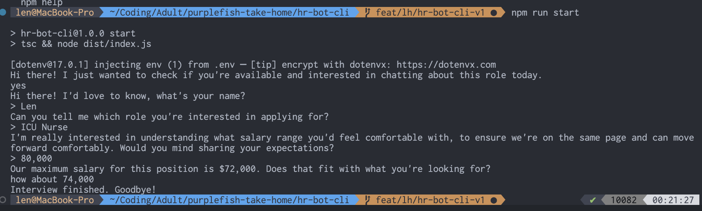
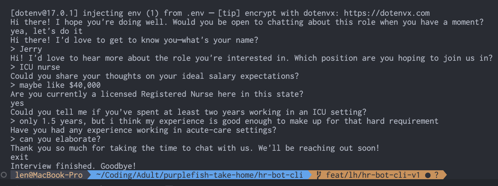

# HR Bot CLI

I got a general gist for how these agent things kinda work, going to try messing around with a v0 backend by only using CLI as a frontend. I'm less confident on this part and so I think this will help me iterate more quickly.

https://sqlitebrowser.org/dl/

### Version 0

I was able to get some bare bones stuff going!

### Version 0.1

Added some basic LLM functionality.

### Version 0.5

I plugged back in the v0 code and gave it back to ChatGPT to ask how it might improve, also including the original take-home PDF as context. I asked it to improve the script, still just focusing on CLI as the frontend. With just one shot, I was able to improve the chat bot a decent bit!

With this, I have a few follow up questions.

- How can I design this notion of "steps" to be easily iterable and experimented on? How can I make it customizable for different roles that might need different templates?

- The questions are all hardcoded. How can I make this more customizable, such that staffing agencies can pass in steps but then the LLM can still make sure it checks all these boxes in a natural way?

- How can I separate the direct SQL calls away from the functionality, so that the database functionality is decoupled from the agent code?

- I see we have given the agent two methods of sorts -- handle, and prompt. Is this the most common pattern? What else might I include here? What if candidate gives a "not good enough" response? Like how do we negotiate with the candidate? Can we have some like clarify_answer method that runs at most some X amount of times? Then we could generically call this multiple times to get more details. This may be good if a candidate has some "uhh's" over phone call or something.

- How do I give a candidate an out to change their answer, or maybe ask for the recrutier to repeat the question?

### Version 1

I gave all the above as feedback to the LLM, and it went crazy! Writing constructors and very object oriented looking code that I'm not used to seeing in Typescript, but reflected many common C# patterns I see at work. With this in mind, I felt that it could be more extensible to multiple job types, styles of scripts, and more.

Here's an example of a very simple negotation happening. It could use some work, but it's progress!

I needed some bug fixes, like deduplicating code, and creating a seed file, but it got VERY far in just a few prompts and $2 worth of Claude Sonnet 3.5 lol.

It didn't seem too happy when I asked for help clarifying what acute care was... oops.

Finally, the underlying database was a little messy. I think my next steps will be getting this data cleaner. Taking a step back, now that I have this proof of concept built out, how do I want to approach this website?

I'm thinking:

- Frontend that lets you log in as candidate or company
- Candidate view:
  - Frontend that lets you pick from a set of jobs to get "screened" for.
  - Upon picking, that opens up a chat session that interacts with the chat bot.
- Company view:
  - Insights dashboard with aggregate stats
  - View how many people have interviewed so far for each role
  - Also have view for all candidates (paginated?) to see data specific to them.
  - We should know how to format them since the template (could/is?) stored somewhere central.

Candidate view is most important here. I think a full database viewer with some simple UI components is probably enough for "company view" for now.

# Version 1.5

Here, I started struggling a bit. I lost context on what the code was doing and every prompt I would stray further away from the original intent. Attempts to debug build errors led to it going down more and more of a rabbit hole. I decided that I needed to do something more legit for my database solution. The AI was trying to recreate it's own repository pattern (as per my initial guidance). At this point, I recalled from the prompt that I should probably use some ORM type thing. After asking for pros and cons between Drizzle, Prisma, and a few others, I decided to go with Drizzle. This version is me starting from scratch but with Drizzle instead.

As I started implementing this, I noticed some issues with the API. Often, there would be interfaces that required one or the other to be called. Specifically, there was one that "selected" a template but did not "save" it for use. As such, I informed the AI of its temporal locality issue and was able to have it fix it.

I even ran into some issues with the dependency injection stuff, where there was a subtle SQLite/Drizzle write visibility issue due to mixed db instance usage. After a lot of back and forth, I was able to get it actually focus on some of the database stuff. Instead of running a raw SQL query, using the drizzle callbacks worked better. Changing it to print better helped as well, and actually persist and load the templates from the DB rather than in memory.
