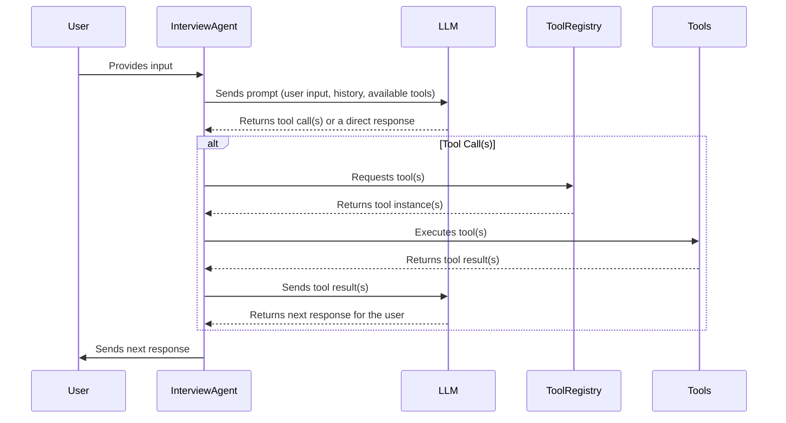

# Architecture V2: LLM-Powered Interview Agent

This document outlines a new architecture for the `hr-bot-cli` that evolves it from a rigid, condition-based state machine to a more flexible, LLM-powered agent that can use tools.

## 1. Core Principles

- **LLM-driven:** An LLM will be at the heart of the agent, responsible for understanding user input and deciding the next action.
- **Tool-based:** The agent's capabilities will be encapsulated in a set of "tools" that the LLM can choose to use. This makes the agent extensible and its capabilities clear.
- **Flexible Conversation Flow:** The rigid `conditions` and `nextSteps` in the current `Step` interface will be replaced by the LLM's ability to reason and select tools.

## 2. New Architecture Overview

The new architecture will consist of the following components:

- **`InterviewAgent`:** The main class that orchestrates the interview. It will be responsible for interacting with the LLM, executing tools, and managing the conversation state.
- **LLM with Tool-Calling:** We will use a large language model that supports tool-calling (e.g., from OpenAI, Anthropic, or Google). The LLM will be prompted with the user's input, the conversation history, and a list of available tools.
- **`Tool` Interface:** A new interface will define the structure of a tool. Each tool will have a `name`, `description`, `input_schema`, and an `execute` method.
- **Tool Registry:** A central registry will hold all the available tools, making them discoverable by the `InterviewAgent`.
- **Modified `Step` Interface:** The `Step` interface will be simplified. Instead of `conditions` and `nextSteps`, it will define the prompt for the LLM and the tools available at that step.

## 3. Tool Definition and Management

Tools are the building blocks of the agent's capabilities. They encapsulate specific actions the agent can take.

### `Tool` Interface

```typescript
interface Tool {
  name: string;
  description: string;
  input_schema: z.ZodObject<any>; // Using Zod for schema validation
  execute(input: any): Promise<any>;
}
```

### Example Tools

Here are some examples of how the existing logic can be encapsulated into tools:

- **`ValidateNumericInputTool`:**
  - **Description:** "Validates that the input is a number and optionally checks if it meets certain criteria (e.g., greater than, less than)."
  - **`execute`:** Takes a numeric string and a condition (e.g., `"> 5"`) and returns whether the condition is met.
- **`ValidateRegexTool`:**
  - **Description:** "Validates that the input matches a given regular expression."
  - **`execute`:** Takes a string and a regex pattern and returns whether the string matches the pattern.
- **`NextStepTool`:**
  - **Description:** "Moves the conversation to the next step."
  - **`execute`:** Takes a `stepId` and transitions the conversation to that step.

### Tool Registry

The `ToolRegistry` will be a simple class that holds a map of tool names to `Tool` instances. The `InterviewAgent` will use this registry to fetch the tools available for the current step.

## 4. Modified `Step` Interface

The `Step` interface will be simplified to support the new architecture:

```typescript
export interface Step {
  id: string;
  type: StepType;
  content: string; // The prompt for the LLM
  availableTools: string[]; // An array of tool names available at this step
  metadata: StepMetadata;
}
```

The `conditions` and `nextSteps` fields are removed. The `content` field now serves as the primary prompt for the LLM. The `availableTools` field tells the `InterviewAgent` which tools to make available to the LLM at this step.

## 5. New Information Flow

The following sequence diagram illustrates the new flow of information:



## 6. Plan for Implementation

1.  **Create the `Tool` interface and `ToolRegistry`:** Define the `Tool` interface and create a simple `ToolRegistry` class.
2.  **Implement the initial set of tools:** Create the `ValidateNumericInputTool`, `ValidateRegexTool`, and `NextStepTool`.
3.  **Modify the `Step` interface:** Update the `Step` interface in `hr-bot-cli/src/template-system/types.ts`.
4.  **Update the `InterviewAgent`:**
    - Remove the existing condition-based logic from the `handle` method.
    - Implement the new LLM- and tool-based logic.
    - Integrate with the `ToolRegistry`.
5.  **Update the templates:** Update the example templates to use the new `Step` interface.
6.  **Test the new architecture:** Run the `hr-bot-cli` and verify that the new architecture works as expected.
