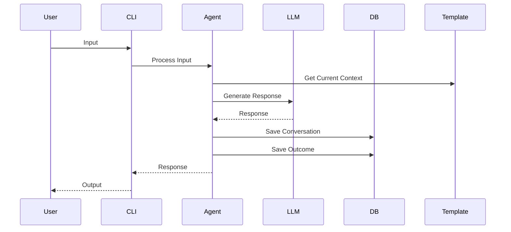

# my-hr-bot-cli Architecture

## Overview

The my-hr-bot-cli is designed with a modular, clean architecture that separates concerns and promotes maintainability. The system is built around several key components that work together to provide a flexible and extensible HR chatbot CLI application.

## Directory Structure

```
my-hr-bot-cli/
├── index.ts                 # Minimal entry point
├── src/
│   ├── agent/              # LLM Agent handling
│   │   ├── index.ts
│   │   ├── agent.ts        # Core agent implementation
│   │   ├── prompt.ts       # Prompt templates
│   │   └── types.ts        # Agent-related types
│   │
│   ├── database/           # Database handling
│   │   ├── index.ts
│   │   ├── service.ts      # Database service
│   │   ├── schema.ts       # Database schema definitions
│   │   ├── migrations/     # Database migrations
│   │   └── repositories/   # Repository implementations
│   │       ├── base.ts
│   │       ├── conversation.ts
│   │       ├── template.ts
│   │       └── outcome.ts
│   │
│   ├── template/           # Template system
│   │   ├── index.ts
│   │   ├── manager.ts      # Template management
│   │   ├── loader.ts       # Template loading/validation
│   │   ├── types.ts        # Template interfaces
│   │   └── templates/      # Template definitions
│   │       └── default.ts
│   │
│   └── utils/             # Shared utilities
       ├── logger.ts
       └── config.ts
```

## Key Components

### 1. Core Agent Module

```typescript
// src/agent/types.ts
interface AgentConfig {
  model: string;
  temperature: number;
  maxTokens: number;
}

interface AgentContext {
  conversationId: string;
  templateId: string;
  userId: string;
}

// src/agent/agent.ts
class HRAgent {
  constructor(
    private config: AgentConfig,
    private llmService: ILLMService,
    private templateManager: ITemplateManager,
    private dbService: IDatabaseService
  ) {}

  async processInput(input: string, context: AgentContext): Promise<string>;
  async loadContext(context: AgentContext): Promise<void>;
  async saveContext(context: AgentContext): Promise<void>;
}
```

### 2. Database Layer

```typescript
// src/database/schema.ts
interface DatabaseSchema {
  conversations: {
    id: string;
    userId: string;
    templateId: string;
    status: "active" | "completed";
    createdAt: Date;
    updatedAt: Date;
  };

  messages: {
    id: string;
    conversationId: string;
    role: "user" | "assistant";
    content: string;
    timestamp: Date;
  };

  outcomes: {
    id: string;
    conversationId: string;
    type: string;
    value: any;
    metadata: Record<string, any>;
    createdAt: Date;
  };

  templates: {
    id: string;
    name: string;
    description: string;
    version: string;
    content: Record<string, any>;
    createdAt: Date;
    updatedAt: Date;
  };
}

// src/database/repositories/base.ts
interface IRepository<T> {
  findById(id: string): Promise<T | null>;
  findAll(filter?: Filter): Promise<T[]>;
  create(entity: T): Promise<T>;
  update(id: string, entity: Partial<T>): Promise<T>;
  delete(id: string): Promise<void>;
}
```

### 3. Template System

```typescript
// src/template/types.ts
interface Template {
  id: string;
  name: string;
  description: string;
  version: string;
  steps: Step[];
  metadata: TemplateMetadata;
}

interface Step {
  id: string;
  type: "question" | "validation" | "branch" | "exit";
  content: string;
  conditions?: Condition[];
  nextSteps: Record<string, string>;
}

interface TemplateMetadata {
  role: string;
  skills: string[];
  expectedDuration: number;
  customFields?: Record<string, any>;
}

// src/template/manager.ts
class TemplateManager {
  async loadTemplate(template: Template): Promise<void>;
  async getTemplate(id: string): Promise<Template | null>;
  async listTemplates(): Promise<Template[]>;
}
```

## Data Flow



## Database Schema

```sql
CREATE TABLE conversations (
    id TEXT PRIMARY KEY,
    user_id TEXT NOT NULL,
    template_id TEXT NOT NULL,
    status TEXT CHECK(status IN ('active', 'completed')) NOT NULL,
    created_at DATETIME DEFAULT CURRENT_TIMESTAMP,
    updated_at DATETIME DEFAULT CURRENT_TIMESTAMP
);

CREATE TABLE messages (
    id TEXT PRIMARY KEY,
    conversation_id TEXT NOT NULL,
    role TEXT CHECK(role IN ('user', 'assistant')) NOT NULL,
    content TEXT NOT NULL,
    timestamp DATETIME DEFAULT CURRENT_TIMESTAMP,
    FOREIGN KEY(conversation_id) REFERENCES conversations(id)
);

CREATE TABLE outcomes (
    id TEXT PRIMARY KEY,
    conversation_id TEXT NOT NULL,
    type TEXT NOT NULL,
    value JSON NOT NULL,
    metadata JSON,
    created_at DATETIME DEFAULT CURRENT_TIMESTAMP,
    FOREIGN KEY(conversation_id) REFERENCES conversations(id)
);

CREATE TABLE templates (
    id TEXT PRIMARY KEY,
    name TEXT NOT NULL,
    description TEXT,
    version TEXT NOT NULL,
    content JSON NOT NULL,
    created_at DATETIME DEFAULT CURRENT_TIMESTAMP,
    updated_at DATETIME DEFAULT CURRENT_TIMESTAMP
);

CREATE INDEX idx_conversations_user_id ON conversations(user_id);
CREATE INDEX idx_messages_conversation_id ON messages(conversation_id);
CREATE INDEX idx_outcomes_conversation_id ON outcomes(conversation_id);
```

## Template System Design

The template system supports multiple templates via a dropdown through the following design:

1. **Template Storage**: Templates are stored in both the filesystem (for version control) and database (for runtime access)
2. **Template Loading**: Templates are validated on load using TypeScript interfaces
3. **Template Selection**: Templates can be selected via:
   - CLI arguments
   - Interactive prompt
   - API endpoint (future extension)
4. **Template Versioning**: Supports multiple versions of the same template
5. **Template Inheritance**: Templates can extend base templates

## Implementation Notes

1. **Minimal index.ts**:

   - Only handles CLI setup and dependency injection
   - Delegates all logic to appropriate modules

2. **SQL Handling**:

   - Uses repository pattern for data access
   - Centralizes SQL logic in dedicated repositories
   - Supports transaction management

3. **LLM Integration**:

   - Abstracts LLM provider behind interface
   - Supports multiple LLM providers
   - Handles rate limiting and retries

4. **Persistence**:

   - Uses SQLite for local storage
   - Implements efficient indexing
   - Supports data export/import

5. **Error Handling**:
   - Custom error types for different scenarios
   - Consistent error reporting
   - Graceful degradation

## Future Extensions

1. **API Mode**: Support running as an API server
2. **Multiple LLMs**: Support multiple LLM providers
3. **Analytics**: Add conversation analytics
4. **Export**: Support exporting conversations
5. **Web Interface**: Add web-based template editor

## Database Seeding

The system includes a robust seeding mechanism to populate the database with sample data for development and testing purposes.

### Seed Data Structure

```typescript
// src/database/seeds/types.ts
interface SeedData {
  templates: Template[];
  conversations: {
    id: string;
    userId: string;
    templateId: string;
    messages: {
      role: "user" | "assistant";
      content: string;
      timestamp: Date;
    }[];
    outcomes: {
      type: string;
      value: any;
      metadata?: Record<string, any>;
    }[];
  }[];
}
```

### Seeding Mechanism

```typescript
// src/database/seeds/seeder.ts
class DatabaseSeeder {
  constructor(private dbService: DatabaseService) {}

  async seed(): Promise<void> {
    // Load seed data
    const seedData = await this.loadSeedData();

    // Begin transaction
    await this.dbService.beginTransaction();

    try {
      // Seed templates
      for (const template of seedData.templates) {
        await this.dbService.templates.create(template);
      }

      // Seed conversations with messages and outcomes
      for (const conv of seedData.conversations) {
        const conversation = await this.dbService.conversations.create({
          id: conv.id,
          userId: conv.userId,
          templateId: conv.templateId,
          status: "completed",
          createdAt: new Date(),
          updatedAt: new Date(),
        });

        // Add messages
        for (const msg of conv.messages) {
          await this.dbService.messages.create({
            conversationId: conversation.id,
            ...msg,
          });
        }

        // Add outcomes
        for (const outcome of conv.outcomes) {
          await this.dbService.outcomes.create({
            conversationId: conversation.id,
            ...outcome,
          });
        }
      }

      // Commit transaction
      await this.dbService.commitTransaction();
    } catch (error) {
      // Rollback on error
      await this.dbService.rollbackTransaction();
      throw error;
    }
  }

  private async loadSeedData(): Promise<SeedData> {
    // Load seed data from JSON files
    return {
      templates: [
        {
          id: "software-engineer-template",
          name: "Software Engineer Interview",
          description: "Technical interview for software engineering positions",
          version: "1.0.0",
          steps: [
            {
              id: "intro",
              type: "question",
              content:
                "Tell me about your experience with modern JavaScript frameworks.",
              nextSteps: { default: "technical" },
            },
            // Additional steps...
          ],
          metadata: {
            role: "Software Engineer",
            skills: ["JavaScript", "React", "Node.js"],
            expectedDuration: 45,
          },
        },
      ],
      conversations: [
        {
          id: "sample-interview-1",
          userId: "user123",
          templateId: "software-engineer-template",
          messages: [
            {
              role: "assistant",
              content:
                "Tell me about your experience with modern JavaScript frameworks.",
              timestamp: new Date("2025-07-02T10:00:00Z"),
            },
            {
              role: "user",
              content: "I have 3 years of experience with React and Vue.js...",
              timestamp: new Date("2025-07-02T10:01:00Z"),
            },
          ],
          outcomes: [
            {
              type: "technical_score",
              value: 85,
              metadata: {
                strengths: ["framework_knowledge", "problem_solving"],
                areas_for_improvement: ["system_design"],
              },
            },
          ],
        },
      ],
    };
  }
}

// Usage in CLI
if (process.argv.includes("--seed")) {
  const seeder = new DatabaseSeeder(dbService);
  await seeder.seed();
  console.log("Database seeded successfully");
  process.exit(0);
}
```

This seeding mechanism provides:

1. Structured seed data with TypeScript types
2. Transaction support for atomic seeding
3. Sample templates and conversations
4. CLI integration for easy seeding
5. Error handling with rollback support

The seed data includes realistic examples of:

- Interview templates with steps and conditions
- Conversation flows with both user and assistant messages
- Interview outcomes with scoring and feedback
- Metadata for templates and outcomes

To seed the database:

```bash
npm run cli -- --seed
```
