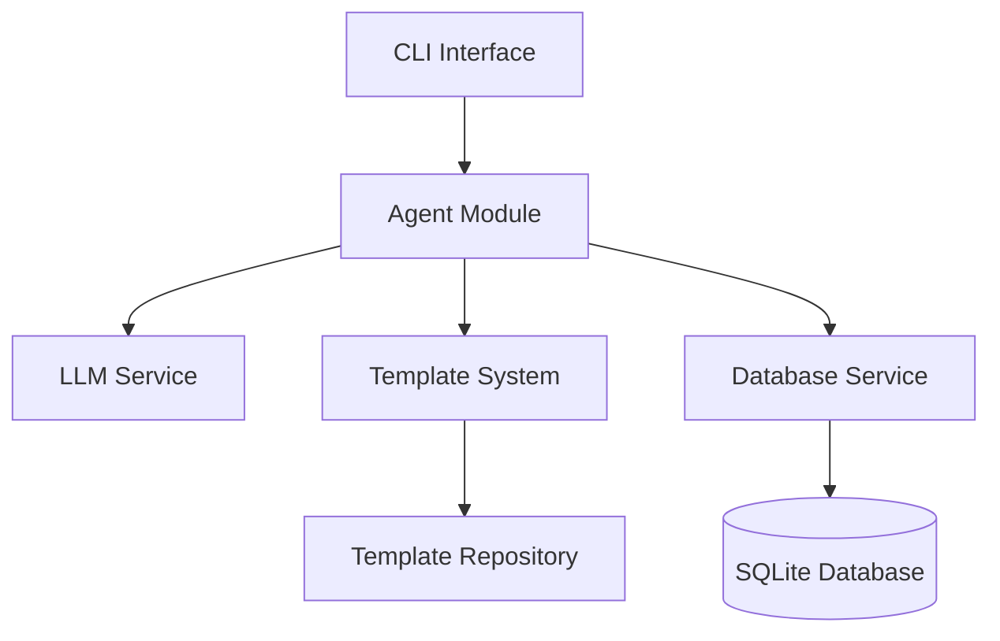

# my-hr-bot-cli

A modern, flexible CLI tool for conducting automated HR interviews with advanced template support and conversation management.

## Project Overview

### Purpose and Features

- Automated interview management through CLI interface
- Flexible template system for different interview types
- Conversation persistence and analysis
- Real-time interview flow control
- Template customization and inheritance
- Built-in templates for common roles

### Architecture Overview

The project follows a modular, clean architecture with clear separation of concerns:



Key components:

- **Agent Module**: Manages interview flow and LLM interactions
- **Template System**: Handles interview templates and customization
- **Database Service**: Manages persistence and data access
- **CLI Interface**: Provides user interaction

### Key Improvements Over Original hr-bot-cli

1. **Enhanced Template System**

   - Template inheritance support
   - Version control integration
   - Runtime validation
   - Dynamic template loading

2. **Improved Database Schema**

   - Better relationship modeling
   - Efficient indexing
   - Transaction support
   - Data export/import capabilities

3. **Robust Error Handling**

   - Custom error types
   - Graceful degradation
   - Detailed error reporting
   - Recovery mechanisms

4. **Type Safety**
   - Comprehensive TypeScript integration
   - Runtime type validation
   - Interface-driven development

## Setup Instructions

### Prerequisites

- Node.js (v16 or higher)
- npm or yarn
- OpenAI API key

### Installation Steps

1. Clone the repository:

   ```bash
   git clone https://github.com/yourusername/my-hr-bot-cli.git
   cd my-hr-bot-cli
   ```

2. Install dependencies:

   ```bash
   npm install
   ```

3. Copy environment configuration:
   ```bash
   cp .env.sample .env
   ```

### Environment Configuration

Configure the following environment variables in `.env`:

```env
OPENAI_API_KEY=your_api_key_here
LLM_MODEL=gpt-4.1-nano  # Optional, defaults to gpt-4.1-nano
LLM_TEMPERATURE=0.7     # Optional, defaults to 0.7
DB_FILENAME=hr-bot.db   # Optional, defaults to hr-bot.db
TEMPLATE_DIR=./templates # Optional, defaults to built-in templates
```

### Database Setup

The database is automatically initialized on first run. To seed with sample data:

```bash
npm run cli -- --seed
```

## Usage Guide

### Basic Usage

1. Start a new interview:

   ```bash
   npm run cli interview start
   ```

2. List available templates:

   ```bash
   npm run cli template list
   ```

3. View interview history:
   ```bash
   npm run cli history
   ```

### Template Selection and Customization

1. Select a template:

   ```bash
   npm run cli interview start --template software-engineer
   ```

2. Use a custom template:
   ```bash
   npm run cli interview start --template-path ./my-templates/custom.ts
   ```

### Available Commands

- `interview`

  - `start`: Start a new interview
  - `resume`: Resume an existing interview
  - `list`: List active interviews

- `template`

  - `list`: List available templates
  - `create`: Create a new template
  - `validate`: Validate a template

- `history`

  - `list`: View interview history
  - `export`: Export interview data

- `config`
  - `show`: Display current configuration
  - `set`: Update configuration

### Interview Flow Explanation

1. **Template Selection**: Choose or specify an interview template
2. **Initialization**: System loads template and prepares interview context
3. **Question Flow**: Follow template-defined interview structure
4. **Response Processing**: Analyze and store responses
5. **Outcome Generation**: Generate interview summary and recommendations

## Template Development

### Template Structure

```typescript
interface Template {
  id: string;
  name: string;
  description: string;
  version: string;
  steps: Step[];
  metadata: TemplateMetadata;
}

interface Step {
  id: string;
  type: "question" | "validation" | "branch" | "exit";
  content: string;
  conditions?: Condition[];
  nextSteps: Record<string, string>;
}
```

### Creating Custom Templates

1. Create a new TypeScript file in your templates directory
2. Define your template structure
3. Export the template configuration
4. Validate using the CLI tool

Example template:

```typescript
export const template: Template = {
  id: "custom-role",
  name: "Custom Role Interview",
  description: "Interview template for custom role",
  version: "1.0.0",
  steps: [
    {
      id: "intro",
      type: "question",
      content: "Tell me about your background",
      nextSteps: { default: "experience" },
    },
    // Additional steps...
  ],
  metadata: {
    role: "Custom Role",
    skills: ["skill1", "skill2"],
    expectedDuration: 30,
  },
};
```

### Best Practices

1. **Template Organization**

   - Use clear step IDs
   - Group related questions
   - Include validation steps
   - Define clear exit conditions

2. **Content Guidelines**

   - Write clear, concise questions
   - Include follow-up prompts
   - Define validation criteria
   - Add helpful metadata

3. **Flow Control**
   - Plan question sequences
   - Handle edge cases
   - Include recovery paths
   - Define skip conditions

### Example Templates

The system includes several built-in templates:

1. Software Engineer (`templates/software-engineer.ts`)
2. Senior Engineer (`templates/senior-engineer.ts`)
3. ICU Nurse (`templates/icu-nurse.ts`)

## Configuration

### Environment Variables

| Variable        | Description                | Default       |
| --------------- | -------------------------- | ------------- |
| OPENAI_API_KEY  | OpenAI API key             | Required      |
| LLM_MODEL       | LLM model to use           | gpt-4.1-nano  |
| LLM_TEMPERATURE | LLM temperature            | 0.7           |
| DB_FILENAME     | Database file path         | hr-bot.db     |
| TEMPLATE_DIR    | Custom templates directory | Built-in path |

### LLM Settings

- **Model**: Supports OpenAI GPT models
- **Temperature**: Controls response creativity (0.0-1.0)
- **Token Limits**: Automatically managed by the system
- **Error Handling**: Automatic retry with backoff

### Database Configuration

- **Storage**: SQLite database
- **Migrations**: Automatic schema updates
- **Backup**: Automatic daily backups
- **Performance**: Optimized indexes and queries

### Template Configuration

- **Location**: Custom template directory support
- **Validation**: Automatic template validation
- **Hot Reload**: Dynamic template updates
- **Inheritance**: Template extension support

## Contributing

Please read [CONTRIBUTING.md](CONTRIBUTING.md) for details on our code of conduct and the process for submitting pull requests.

## License

This project is licensed under the MIT License - see the [LICENSE](LICENSE) file for details.
